---
## Front matter
lang: ru-RU
title: Презентация по лабораторной работе №1
subtitle: Установка ОС Linux
author:
  - Аджигалиева А. Р.
institute:
  - РУДН, Москва, Россия
date: 7 марта 2025

## i18n babel
babel-lang: russian
babel-otherlangs: english

## Formatting pdf
toc: false
toc-title: Содержание
slide_level: 2
aspectratio: 169
section-titles: true
theme: metropolis
header-includes:
 - \metroset{progressbar=frametitle,sectionpage=progressbar,numbering=fraction}
---

# Информация

## Докладчик

:::::::::::::: {.columns align=center}
::: {.column width="70%"}

  * Аджигалиева Амина Руслановна
  * студентка 1 курса НПИбд-02-24
  * Российский университет дружбы народов

:::
::: {.column width="30%"}

:::
::::::::::::::

# Вводная часть

## Объект и предмет иследования

- ОС Linux Fedora Sway

## Цели и задачи

Целью данной работы является приобретение практических навыков установки операционной системы на виртуальную машину, настройки минимально необходимых для дальнейшей работы сервисов.

## Материалы и методы

- Терминал

# Создание презентации

## Установка ОС

## Вкод в систему

## Супер-пользователь

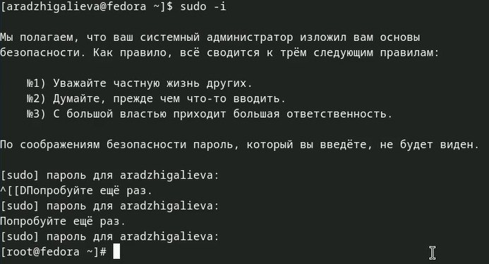

## Обновления

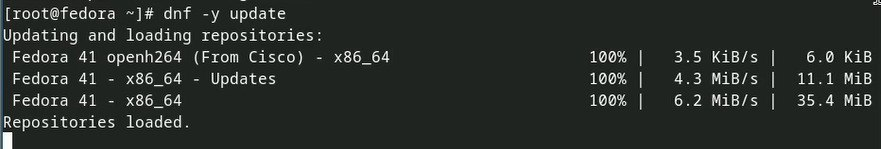

## Программа для консоли

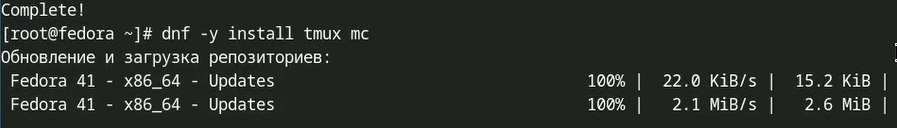

## Установка программного обеспечения

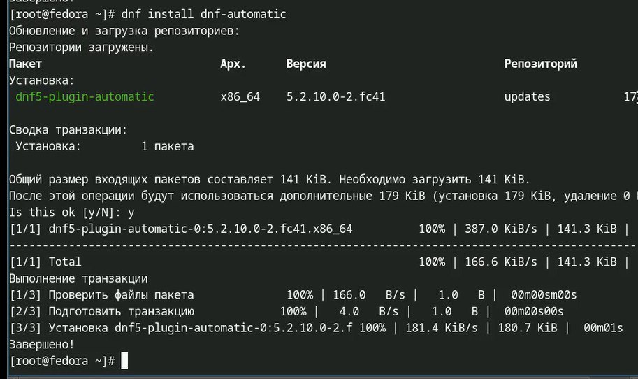

## Запуск таймера

## Отключение SELinux

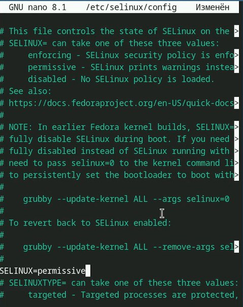

## Создание конфигурационного файла

## Редактирование файла

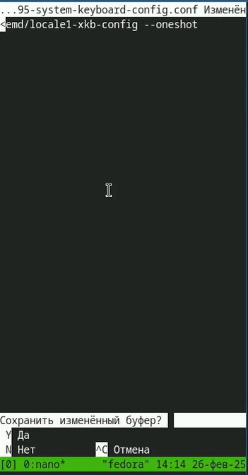

## Редактирование /etc/X11/xorg.conf.d/00-keyboard.conf

## Установка имени пользователя и названия хоста

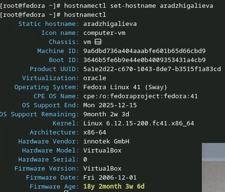

## Работа с языком разметки Markdown

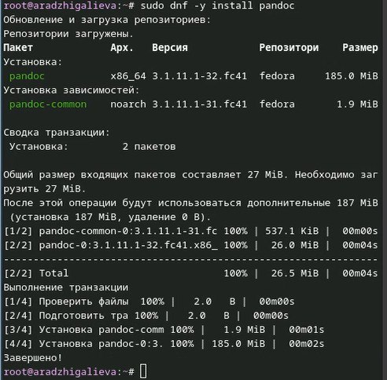

## Распаковка архивов

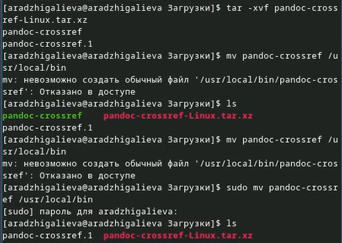

## Texlive

# Домашнее задание

## Анализ последовательности загрузки системы

## Версия ядра Linux

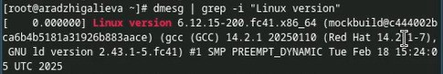

## Частота процессора 

## Модель процессора

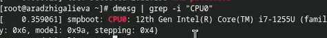

## Объём доступной оперативной памяти 

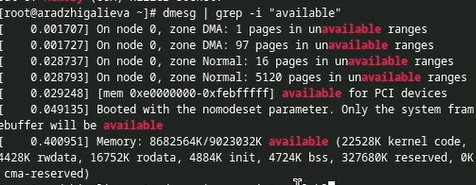

## Тип обнаруженного гипервизора 

## Тип файловой системы корневого раздела

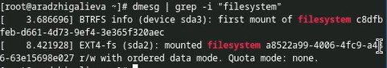

