---
## Front matter
title: "Отчёт по лабораторной работе №1"
subtitle: "Установка ОС Linux"
author: "Аджигалиева Амина Руслановна"

## Generic otions
lang: ru-RU
toc-title: "Содержание"

## Bibliography
bibliography: bib/cite.bib
csl: pandoc/csl/gost-r-7-0-5-2008-numeric.csl

## Pdf output format
toc: true # Table of contents
toc-depth: 2
lof: true # List of figures
fontsize: 12pt
linestretch: 1.5
papersize: a4
documentclass: scrreprt
## I18n polyglossia
polyglossia-lang:
  name: russian
  options:
	- spelling=modern
	- babelshorthands=true
polyglossia-otherlangs:
  name: english
## I18n babel
babel-lang: russian
babel-otherlangs: english
## Fonts
mainfont: IBM Plex Serif
romanfont: IBM Plex Serif
sansfont: IBM Plex Sans
monofont: IBM Plex Mono
mathfont: STIX Two Math
mainfontoptions: Ligatures=Common,Ligatures=TeX,Scale=0.94
romanfontoptions: Ligatures=Common,Ligatures=TeX,Scale=0.94
sansfontoptions: Ligatures=Common,Ligatures=TeX,Scale=MatchLowercase,Scale=0.94
monofontoptions: Scale=MatchLowercase,Scale=0.94,FakeStretch=0.9
mathfontoptions:
## Biblatex
biblatex: true
biblio-style: "gost-numeric"
biblatexoptions:
  - parentracker=true
  - backend=biber
  - hyperref=auto
  - language=auto
  - autolang=other*
  - citestyle=gost-numeric
## Pandoc-crossref LaTeX customization
figureTitle: "Рис."
tableTitle: "Таблица"
listingTitle: "Листинг"
lofTitle: "Список иллюстраций"
lolTitle: "Листинги"
## Misc options
indent: true
header-includes:
  - \usepackage{indentfirst}
  - \usepackage{float} # keep figures where there are in the text
  - \floatplacement{figure}{H} # keep figures where there are in the text
---

# Цель работы

Целью данной работы является приобретение практических навыков установки операционной системы на виртуальную машину, настройки минимально необходимых для дальнейшей работы сервисов.

# Выполнение лабораторной работы

## Техническое обеспечение

Скачиваем и устанавливаем Linux Fedora Sway (рис. [-@fig:001]), (рис. [-@fig:002]), (рис. [-@fig:003]), (рис. [-@fig:004]), (рис. [-@fig:005]).

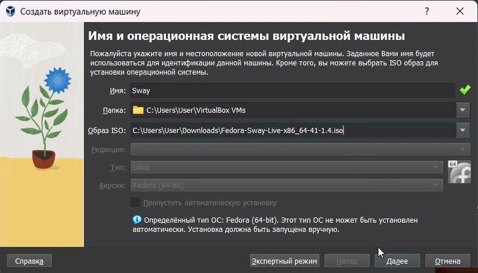{#fig:001 width=70%}

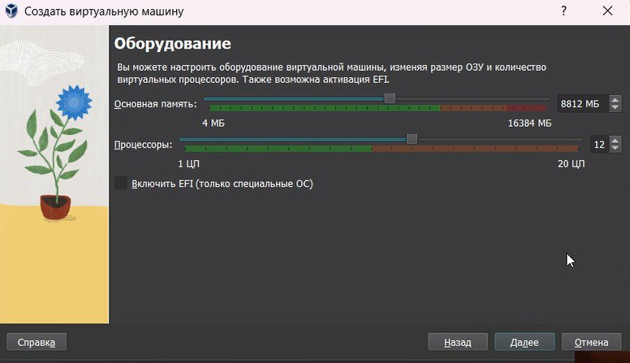{#fig:002 width=70%}

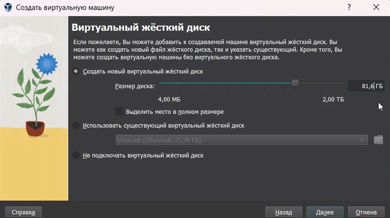{#fig:003 width=70%}

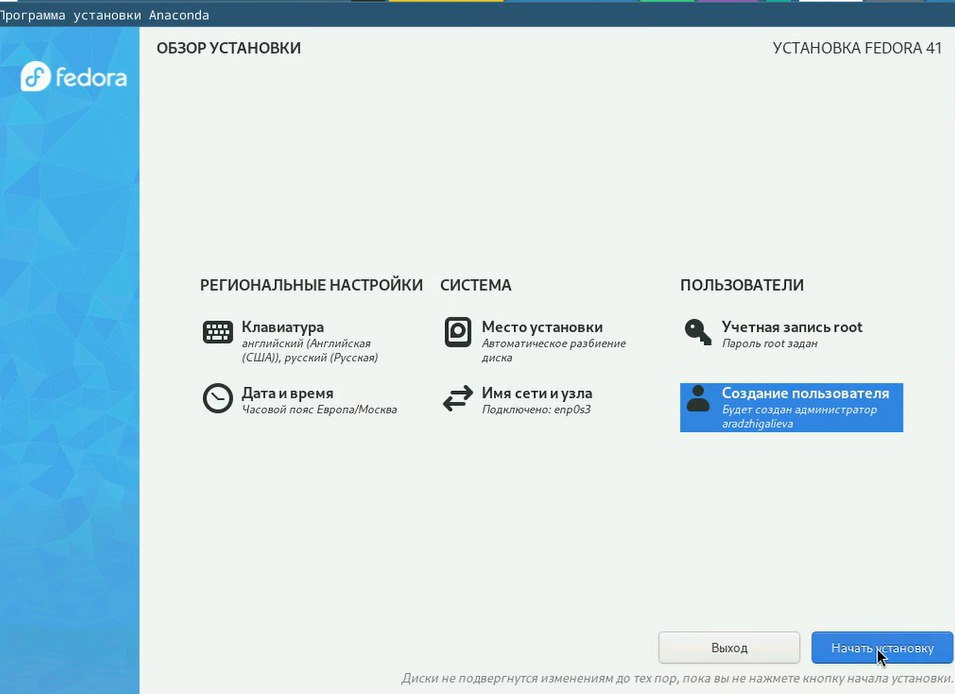{#fig:004 width=70%}

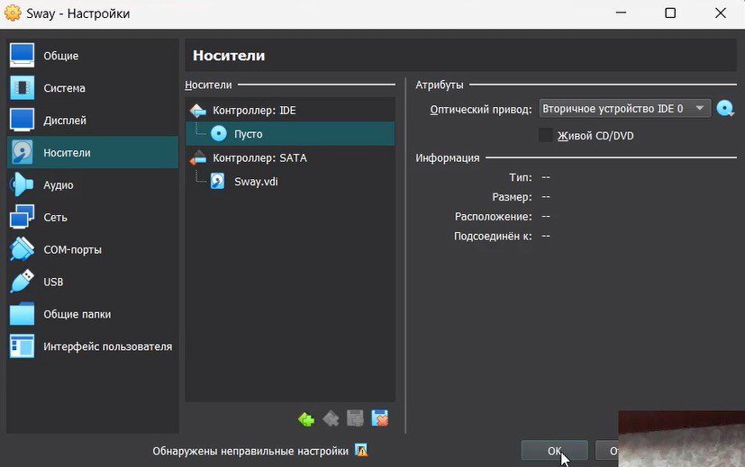{#fig:005 width=70%}

## После установки

Входим в своего пользователя: (рис. [-@fig:006]).

{#fig:006 width=70%}

Переключитесь на роль супер-пользователя: (рис. [-@fig:007]).

{#fig:007 width=70%}

### Обновления

Обновить все пакеты (рис. [-@fig:008]).

{#fig:008 width=70%}

### Повышение комфорта работы

Программы для удобства работы в консоли: (рис. [-@fig:009]).

{#fig:009 width=70%}

### Автоматическое обновление

Установка программного обеспечения: (рис. [-@fig:010]).

{#fig:010 width=70%}

Запустите таймер: (рис. [-@fig:011]).

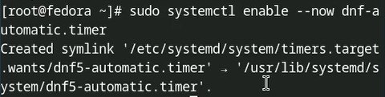{#fig:011 width=70%}

### Отключение SELinux

В файле /etc/selinux/config замените значение SELINUX=enforcing (рис. [-@fig:012]).

{#fig:012 width=70%}

Перегрузите виртуальную машину: (рис. [-@fig:013]).

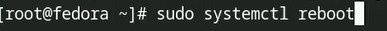{#fig:013 width=70%}

## Настройка раскладки клавиатуры

Запустите терминальный мультиплексор tmux: (рис. [-@fig:014]).

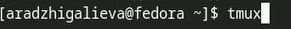{#fig:014 width=70%}

Создайте конфигурационный файл ~/.config/sway/config.d/95-system-keyboard-config.conf: (рис. [-@fig:015]).

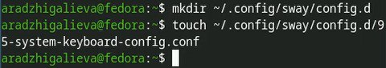{#fig:015 width=70%}

Отредактируйте конфигурационный файл (рис. [-@fig:016]).

{#fig:016 width=70%}

Переключитесь на роль супер-пользователя: (рис. [-@fig:017]).

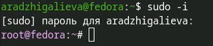{#fig:017 width=70%}

Отредактируйте конфигурационный файл /etc/X11/xorg.conf.d/00-keyboard.conf: (рис. [-@fig:018]).

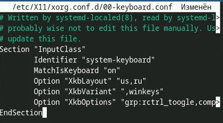{#fig:018 width=70%}

Перегрузите виртуальную машину: (рис. [-@fig:019]).

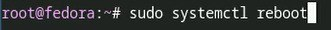{#fig:019 width=70%}

## Установка имени пользователя и названия хоста

Установите имя хоста. Проверьте, что имя хоста установлено верно: (рис. [-@fig:020]).

{#fig:020 width=70%}

## Установка программного обеспечения для создания документации

Переключитесь на роль супер-пользователя: (рис. [-@fig:021]).

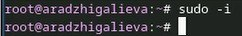{#fig:021 width=70%}

### Работа с языком разметки Markdown

Средство pandoc для работы с языком разметки Markdown. Установка с помощью менеджера пакетов: (рис. [-@fig:022]).

{#fig:022 width=70%}

Скачайте необходимую версию pandoc-crossref (рис. [-@fig:023]).

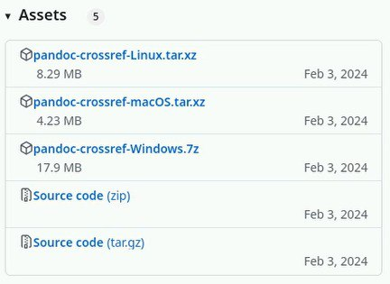{#fig:023 width=70%}

Распакуйте архивы.
Обе программы собраны в виде статически-линкованных бинарных файлов. (рис. [-@fig:024]).

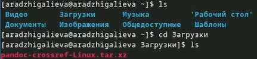{#fig:024 width=70%}

Поместите их в каталог /usr/local/bin. (рис. [-@fig:025]).

{#fig:025 width=70%}

### Texlive

Установим дистрибутив TeXlive: (рис. [-@fig:026]).

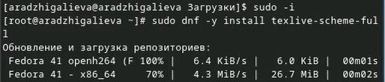{#fig:026 width=70%}

## Домашнее задание

Дождитесь загрузки графического окружения и откройте терминал. В окне терминала проанализируйте последовательность загрузки системы, выполнив команду dmesg. Можно просто просмотреть вывод этой команды: (рис. [-@fig:027]).

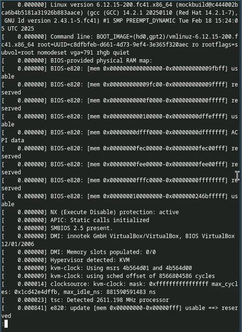{#fig:027 width=70%}

Версия ядра Linux (Linux version) (рис. [-@fig:028]).

{#fig:028 width=70%}

Частота процессора: (рис. [-@fig:029]).

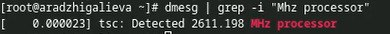{#fig:029 width=70%}

Модель процессора (рис. [-@fig:030]).

{#fig:030 width=70%}

Объём доступной оперативной памяти (рис. [-@fig:031]).

{#fig:031 width=70%}

Тип обнаруженного гипервизора (рис. [-@fig:032]).

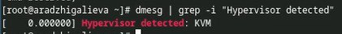{#fig:032 width=70%}

Тип файловой системы корневого раздела (рис. [-@fig:033]).

{#fig:033 width=70%}

# Контрольные вопросы

## Какую информацию содержит учётная запись пользователя?  
Учётная запись пользователя в Linux содержит:  
- Имя пользователя (логин) – уникальный идентификатор.  
- UID (User ID) – числовой идентификатор пользователя.  
- GID (Group ID) – идентификатор основной группы пользователя.  
- Домашний каталог – личное пространство пользователя.  
- Оболочка (Shell) – программа для выполнения команд (например, bash, zsh).  
- Пароль (или его хеш) – данные для аутентификации.  

Эти данные хранятся в файлах:  
- /etc/passwd – основные сведения о пользователе.  
- /etc/shadow – зашифрованные пароли.  
- /etc/group – группы пользователей.  

---

## Команды терминала  

### Получение справки по команде:  
- man <команда> – открыть руководство.  
  - Пример: man ls  
- <команда> --help – краткая справка.  
  - Пример: ls --help  

### Перемещение по файловой системе:  
- cd <каталог> – перейти в каталог.  
  - Пример: cd /home/user  
- cd .. – подняться на уровень выше.  
- cd ~ – перейти в домашний каталог.  

### Просмотр содержимого каталога:  
- ls – список файлов.  
  - ls -l – детальная информация.  
  - ls -a – скрытые файлы.  

### Определение объёма каталога:  
- du -sh <каталог> – размер каталога.  
  - Пример: du -sh /home/user  
- df -h – свободное место на диске.  

### Создание / удаление каталогов и файлов:  
- mkdir <каталог> – создать каталог.  
  - Пример: mkdir mydir  
- rmdir <каталог> – удалить пустой каталог.  
- rm -r <каталог> – удалить каталог с файлами.  
  - Пример: rm -r mydir  
- touch <файл> – создать файл.  
  - Пример: touch file.txt  
- rm <файл> – удалить файл.  

### Задание прав на файл / каталог:  
- chmod <права> <файл> – изменить права доступа.  
  - Пример: chmod 755 script.sh  
- chown <пользователь>:<группа> <файл> – сменить владельца.  
  - Пример: chown user:group file.txt  

### Просмотр истории команд:  
- history – вывести список команд.  
- !<номер> – выполнить команду по её номеру в истории.  

---

## Что такое файловая система? Примеры  
Файловая система (ФС) — это структура хранения и организации данных на носителе.  

Примеры:  
- ext4 – основная ФС в Linux, быстрая и надёжная.  
- XFS – хорошо работает с большими файлами.  
- Btrfs – поддерживает моментальные снимки (snapshots).  
- NTFS – ФС Windows, поддерживается в Linux через ntfs-3g.  
- FAT32/exFAT – совместимы с Windows, Linux и macOS.  

---

## Как посмотреть, какие файловые системы подмонтированы?  
- mount – вывести список смонтированных ФС.  
- df -T – показать типы ФС.  
- lsblk -f – вывести таблицу ФС с UUID.  
- cat /etc/fstab – список ФС, монтируемых при загрузке.  

---

## Как удалить зависший процесс?  
- ps aux | grep <имя процесса> – найти процесс.  
- kill <PID> – отправить сигнал завершения.  
- kill -9 <PID> – принудительно завершить процесс.  
- pkill <имя процесса> – завершить по имени.  
- htop – интерактивный менеджер процессов.

# Выводы

Мы приобрели практические навыки установки операционной системы на виртуальную машину, настройки минимально необходимых для дальнейшей работы сервисов.

