---
## Front matter
lang: ru-RU
title: Презентация по лабораторной работе №2
subtitle: Первоначальная настройка git
author:
  - Аджигалиева А. Р.
institute:
  - РУДН, Москва, Россия
date: 7 марта 2025

## i18n babel
babel-lang: russian
babel-otherlangs: english

## Formatting pdf
toc: false
toc-title: Содержание
slide_level: 2
aspectratio: 169
section-titles: true
theme: metropolis
header-includes:
 - \metroset{progressbar=frametitle,sectionpage=progressbar,numbering=fraction}
---

# Информация

## Докладчик

:::::::::::::: {.columns align=center}
::: {.column width="70%"}

  * Аджигалиева Амина Руслановна
  * студентка НПИбд-02-24
  * Российский университет дружбы народов

:::
::: {.column width="30%"}

:::
::::::::::::::

# Вводная часть

## Объект и предмет исследования

- Git

## Цели и задачи

- Изучить идеологию и применение средств контроля версий.
- Освоить умения по работе с git.

## Материалы и методы

- Репозиторий
- Терминал

## Задание

- Создать базовую конфигурацию для работы с git.
- Создать ключ SSH.
- Создать ключ PGP.
- Настроить подписи git.
- Зарегистрироваться на Github.
- Создать локальный каталог для выполнения заданий по предмету.

# Установка программного обеспечения

## Установка git

## Установка gh

# Базовая настройка git

## Зададим имя и email владельца репозитория

## Настроим utf-8

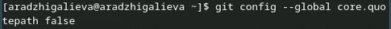

## Зададим имя начальной ветки 

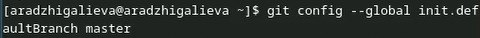

## Параметр autocrlf

## Параметр safecrlf

# Создание ключей ssh

## по алгоритму rsa с ключём размером 4096 бит

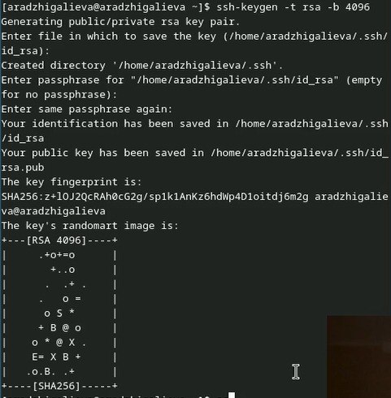

## по алгоритму ed25519

# Создание ключей pgp

## Генерируем ключ

# Добавление PGP ключа в GitHub

## Выводим список ключей и копируем отпечаток приватного ключа

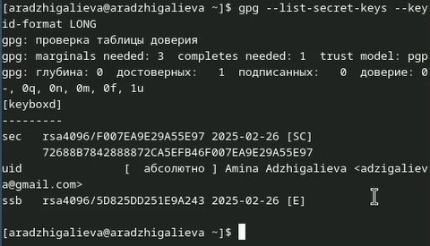

## Cкопируем сгенерированный PGP ключ в буфер обмена

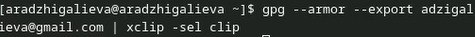

## New GPG key

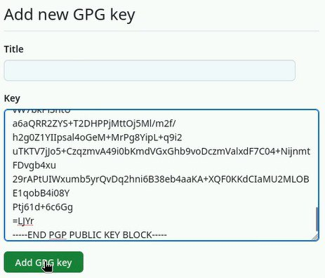

# Настройка автоматических подписей коммитов git

## Используя введёный email, укажите Git применять его при подписи коммитов

# Настройка gh

## Авторизация

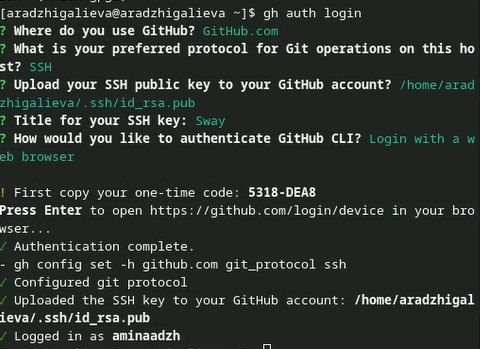

# Шаблон для рабочего пространства

## Сознание репозитория курса на основе шаблона

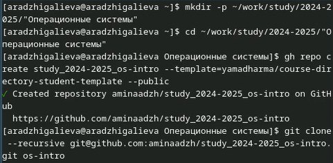

## 

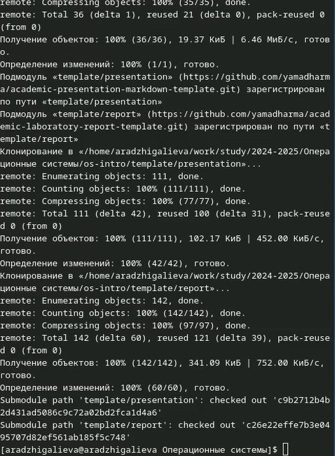

# Настройка каталога курса

## Перейдем в каталог курса

## Удаляем лишние файлы

## Создаем необходимые каталоги

## Отправляем файлы на сервер

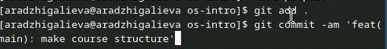

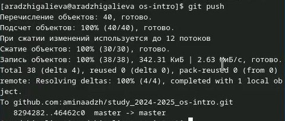

