---
## Front matter
title: "Отчет по лабораторной работе №2"
subtitle: "Первоначальная настройка git"
author: "Аджигалиева Амина Руслановна"

## Generic otions
lang: ru-RU
toc-title: "Содержание"

## Bibliography
bibliography: bib/cite.bib
csl: pandoc/csl/gost-r-7-0-5-2008-numeric.csl

## Pdf output format
toc: true # Table of contents
toc-depth: 2
lof: true # List of figures
fontsize: 12pt
linestretch: 1.5
papersize: a4
documentclass: scrreprt
## I18n polyglossia
polyglossia-lang:
  name: russian
  options:
	- spelling=modern
	- babelshorthands=true
polyglossia-otherlangs:
  name: english
## I18n babel
babel-lang: russian
babel-otherlangs: english
## Fonts
mainfont: IBM Plex Serif
romanfont: IBM Plex Serif
sansfont: IBM Plex Sans
monofont: IBM Plex Mono
mathfont: STIX Two Math
mainfontoptions: Ligatures=Common,Ligatures=TeX,Scale=0.94
romanfontoptions: Ligatures=Common,Ligatures=TeX,Scale=0.94
sansfontoptions: Ligatures=Common,Ligatures=TeX,Scale=MatchLowercase,Scale=0.94
monofontoptions: Scale=MatchLowercase,Scale=0.94,FakeStretch=0.9
mathfontoptions:
## Biblatex
biblatex: true
biblio-style: "gost-numeric"
biblatexoptions:
  - parentracker=true
  - backend=biber
  - hyperref=auto
  - language=auto
  - autolang=other*
  - citestyle=gost-numeric
## Pandoc-crossref LaTeX customization
figureTitle: "Рис."
tableTitle: "Таблица"
listingTitle: "Листинг"
lofTitle: "Список иллюстраций"
lolTitle: "Листинги"
## Misc options
indent: true
header-includes:
  - \usepackage{indentfirst}
  - \usepackage{float} # keep figures where there are in the text
  - \floatplacement{figure}{H} # keep figures where there are in the text
---

# Цель работы

Изучить идеологию и применение средств контроля версий.
Освоить умения по работе с git.

# Задание

Создать базовую конфигурацию для работы с git.  
Создать ключ SSH.  
Создать ключ PGP.  
Настроить подписи git.  
Зарегистрироваться на Github.  
Создать локальный каталог для выполнения заданий по предмету.  

# Выполнение лабораторной работы

## Установка программного обеспечения

Установим git: (рис. [-@fig:001]).

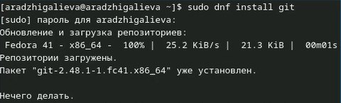{#fig:001 width=70%}

Установим gh: (рис. [-@fig:002]).

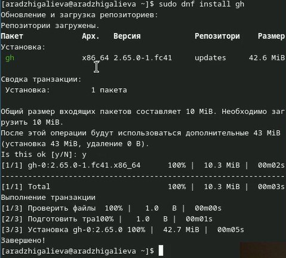{#fig:002 width=70%}

## Базовая настройка git

Зададим имя и email владельца репозитория: (рис. [-@fig:003]), (рис. [-@fig:003]).

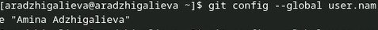{#fig:003 width=70%}

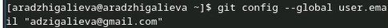{#fig:004 width=70%}

Настроим utf-8 в выводе сообщений git: (рис. [-@fig:005]).

{#fig:005 width=70%}

Зададим имя начальной ветки (будем называть её master): (рис. [-@fig:006]).

{#fig:006 width=70%}

Параметр autocrlf: (рис. [-@fig:007]).

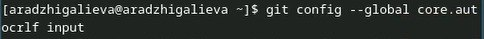{#fig:007 width=70%}

Параметр safecrlf: (рис. [-@fig:008]).

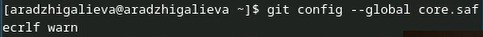{#fig:008 width=70%}

## Создание ключа ssh

по алгоритму rsa с ключём размером 4096 бит: (рис. [-@fig:009]).

{#fig:009 width=70%}

по алгоритму ed25519: (рис. [-@fig:010]).

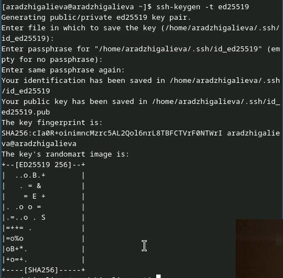{#fig:010 width=70%}

## Создание ключа pgp

Генерируем ключ (рис. [-@fig:011]), (рис. [-@fig:012])

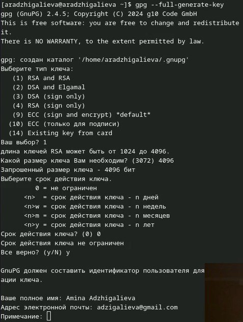{#fig:011 width=70%}

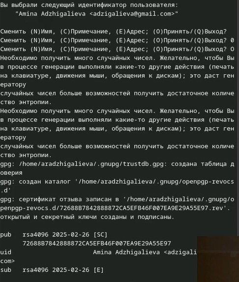{#fig:012 width=70%}

## Добавление PGP ключа в GitHub

Выводим список ключей и копируем отпечаток приватного ключа: (рис. [-@fig:013]).

{#fig:013 width=70%}

Cкопируйте ваш сгенерированный PGP ключ в буфер обмена: (рис. [-@fig:014]).

{#fig:014 width=70%}

Вставьте полученный ключ в поле ввода (рис. [-@fig:015]), (рис. [-@fig:016]).

{#fig:015 width=70%}

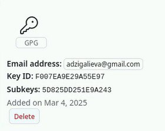{#fig:016 width=70%}

## Настройка автоматических подписей коммитов git

Используя введёный email, укажите Git применять его при подписи коммитов: (рис. [-@fig:017]).

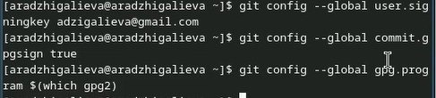{#fig:017 width=70%}

## Настройка gh

Для начала необходимо авторизоваться (рис. [-@fig:018]).

{#fig:018 width=70%}

## Шаблон для рабочего пространства

### Сознание репозитория курса на основе шаблона

Необходимо создать шаблон рабочего пространства (рис. [-@fig:019]), (рис. [-@fig:020]).

{#fig:019 width=70%}

{#fig:020 width=70%}

### Настройка каталога курса

Перейдите в каталог курса: (рис. [-@fig:021]).

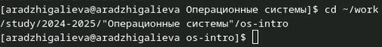{#fig:021 width=70%}

Удалите лишние файлы: (рис. [-@fig:022]).

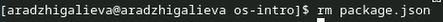{#fig:022 width=70%}

Создайте необходимые каталоги: (рис. [-@fig:023]).

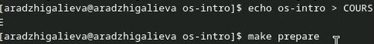{#fig:023 width=70%}

Отправьте файлы на сервер: (рис. [-@fig:024]), (рис. [-@fig:025]), (рис. [-@fig:026])

{#fig:024 width=70%}

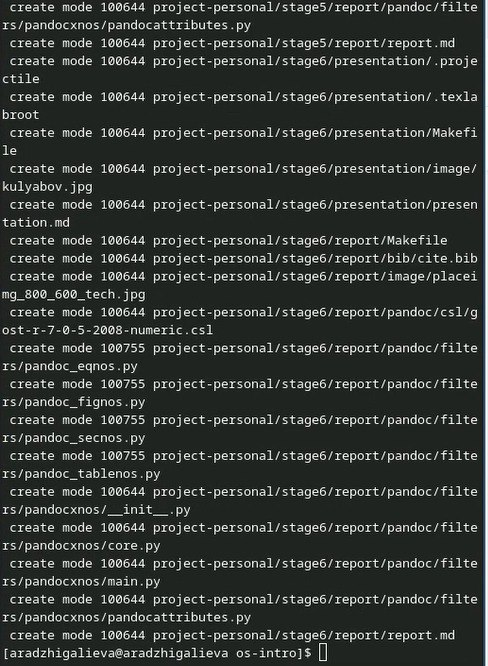{#fig:025 width=70%}

{#fig:026 width=70%}

# Контрольные вопросы

## Что такое системы контроля версий (VCS) и для чего они предназначены?  
Системы контроля версий (Version Control System, VCS) — это инструменты, предназначенные для отслеживания изменений в файлах и управлении их разными версиями. Они позволяют:  
- сохранять историю изменений,  
- работать в команде без потери данных,  
- восстанавливать предыдущие версии файлов,  
- разветвлять код и объединять изменения,  
- отслеживать авторов изменений и причины их внесения.  

---

## Основные понятия VCS  
- Хранилище (репозиторий, repository) — база данных, где хранятся все версии файлов проекта.  
- Commit — сохранённое состояние проекта в репозитории, фиксирующее изменения.  
- История (history) — последовательность commit'ов, отображающая эволюцию проекта.  
- Рабочая копия (working copy) — файлы проекта в локальной папке пользователя, с которыми он работает.  

Связь: Рабочая копия содержит файлы из хранилища, изменения фиксируются в commit'ах, а commit'ы формируют историю проекта.  

---

## Централизованные и децентрализованные VCS  
Централизованные VCS (CVCS):  
 - Один центральный сервер хранит репозиторий.  
 - Разработчики получают последнюю версию файлов и отправляют изменения обратно в центральное хранилище.  
 - Пример: SVN (Subversion), Perforce.  

Децентрализованные VCS (DVCS):  
 - Каждый разработчик имеет полную копию репозитория.  
 - Изменения могут фиксироваться локально, а затем отправляться на сервер или в другие репозитории.  
 - Пример: Git, Mercurial.  

---

## Действия при единоличной работе с VCS  
1. Инициализация репозитория (`git init`).  
2. Добавление файлов под контроль (`git add`).  
3. Фиксация изменений (`git commit -m "Сообщение"`).  
4. Просмотр истории изменений (`git log`).  
5. Создание веток и переключение (`git branch`, `git checkout`).  
6. Откат изменений при необходимости (`git reset`, `git revert`).  

---

## Порядок работы с общим хранилищем VCS  
1. Клонирование репозитория (`git clone`).  
2. Получение последних изменений (`git pull`).  
3. Редактирование файлов и добавление в индекс (`git add`).  
4. Фиксация изменений (`git commit`).  
5. Отправка изменений в удалённый репозиторий (`git push`).  
6. Разрешение конфликтов при слиянии изменений (`git merge`).  

---

## Основные задачи Git  
- Отслеживание изменений в файлах.  
- Создание и работа с ветками.  
- Сохранение локальных изменений и синхронизация с удалёнными репозиториями.  
- Управление командной разработкой.  

---

## Основные команды Git  
| Команда | Описание |
|---------|---------|
| git init | Инициализация нового репозитория. |
| git clone URL | Клонирование репозитория. |
| git add | Добавление изменений в индекс. |
| git commit -m "Сообщение" | Фиксация изменений. |
| git status | Проверка статуса файлов. |
| git log | Просмотр истории коммитов. |
| git branch | Список веток. |
| git checkout | Переключение между ветками. |
| git merge | Слияние веток. |
| git pull | Получение обновлений из удалённого репозитория. |
| git push | Отправка изменений в удалённый репозиторий. |
| git reset | Откат изменений. |
| git revert | Отмена commit'а без изменения истории. |

---

## Примеры использования Git  
Локальный репозиторий:  
git init  
git add .  
git commit -m "Первый коммит"
Работа с удалённым репозиторием:  
git clone https://github.com/user/repo.git  
git pull origin main  
git add .  
git commit -m "Исправил баг"  
git push origin main  

---

## Что такое ветви (branches) и зачем они нужны?  
Ветви (branches) позволяют работать над разными версиями проекта одновременно. Они нужны для:  
- Разработки новых функций без изменения основного кода.  
- Проведения экспериментов.  
- Работы нескольких разработчиков без конфликтов.  

Пример создания и переключения:  
git branch new-feature  
git checkout new-feature  

---

## Игнорирование файлов в Git и зачем это нужно  

При работе с проектом могут появляться файлы, которые не стоит добавлять в репозиторий:  
- Временные файлы  
- Локальные настройки среды разработки.  
- Зависимости  

Чтобы Git не отслеживал такие файлы, используется специальный файл `.gitignore`. В нём указываются шаблоны файлов и папок, которые нужно исключить из репозитория.  

После добавления .gitignore в репозиторий Git не будет учитывать перечисленные файлы при выполнении git add, git commit и других команд. Это помогает избежать засорения репозитория ненужными файлами и сохраняет его чистоту.

# Выводы

Мы изучили идеологию и применение средств контроля версий, а также освоили умения по работе с git.

