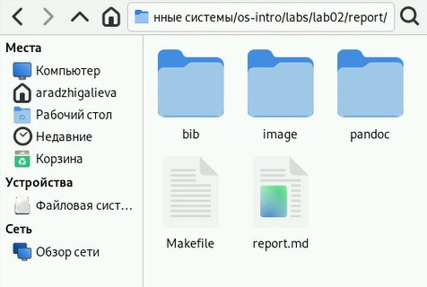
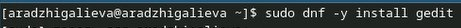
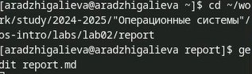
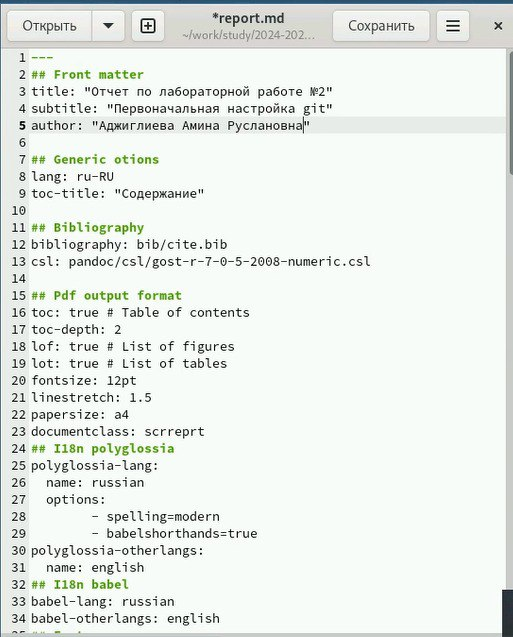
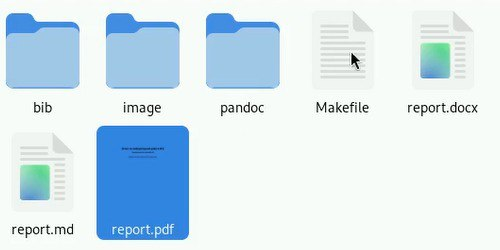

---
## Front matter
lang: ru-RU
title: Презентация по лабораторной работе №3
subtitle: Markdown
author:
  - Аджигалиева А. Р.
institute:
  - РУДН, Москва, Россия
date: 7 марта 2025

## i18n babel
babel-lang: russian
babel-otherlangs: english

## Formatting pdf
toc: false
toc-title: Содержание
slide_level: 2
aspectratio: 169
section-titles: true
theme: metropolis
header-includes:
 - \metroset{progressbar=frametitle,sectionpage=progressbar,numbering=fraction}
---

# Информация

## Докладчик

:::::::::::::: {.columns align=center}
::: {.column width="70%"}

  * Аджигалиева Амина Руслановна
  * Студентка 1 курса НПИбд-02-24
  * Российский университет дружбы народов

:::
::: {.column width="30%"}

:::
::::::::::::::

# Вводная часть

## Объект и предмет исследования

- Markdown

## Цели и задачи

- Научиться оформлять отчёты с помощью легковесного языка разметки Markdown

## Материалы и методы

- Терминал
- Markdown
- Файлы

# Создание презентации

## Открываем файлы 

## Скачиваем gedit

## Переходим в нужный нам каталог и открываем файл report.md

## Меняем файл и пишем отчет по 2 лабораторной работе

## Компилируем файл

## Открываем файлы и видим, что сгенерировались pdf, docx

